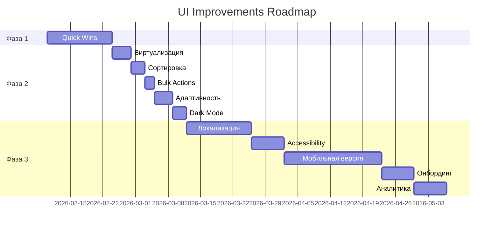

# 📚 Документация проекта "Реестр МКД"

Централизованное хранилище документации для системы учёта многоквартирных домов Кадастр Агентлиги.

---

## 🔥 ВАЖНО: Анализ кода завершен!

**Дата:** 8 февраля 2026  
**Статус:** ✅ Проект проанализирован

### Ключевые находки:
- **Оценка проекта:** 7/10 - Хорошая архитектура ✅
- **Критические проблемы:** 3 (безопасность, размер бандла, логирование)
- **Production-ready:** 2-3 недели

### 📊 Начните с:
1. [**ANALYSIS_SUMMARY_RU.md**](./ANALYSIS_SUMMARY_RU.md) - Краткая сводка (5 мин)
2. [CODE_ANALYSIS_REPORT.md](./CODE_ANALYSIS_REPORT.md) - Полный отчет (30 мин)

---

## 📖 Содержание

### 🔍 Анализ кода и рекомендации (НОВОЕ!)

| Документ | Описание | Целевая аудитория | Время чтения |
|----------|----------|-------------------|--------------|
| [**ANALYSIS_SUMMARY_RU.md**](./ANALYSIS_SUMMARY_RU.md) | 📊 **НАЧНИТЕ ЗДЕСЬ** — Краткая сводка анализа | Team Lead, CTO | 5 мин |
| [CODE_ANALYSIS_REPORT.md](./CODE_ANALYSIS_REPORT.md) | Полный анализ с находками и рекомендациями | Tech Lead, Senior Dev | 30 мин |

### 🏗️ Архитектура и структура проекта

| Документ | Описание | Размер |
|----------|----------|--------|
| [project-discovery-notes.md](./project-discovery-notes.md) | Обзор архитектуры, схемы БД и workflow | 110 строк |
| [project-full-architecture.md](./project-full-architecture.md) | Полная техническая архитектура | - |
| [project-full-code-structure.md](./project-full-code-structure.md) | Структура кодовой базы | - |
| [project-full-workflow.md](./project-full-workflow.md) | Детальное описание workflow | - |

### 💾 База данных

| Документ | Описание | Размер |
|----------|----------|--------|
| [project-full-db-schema.md](./project-full-db-schema.md) | Схема базы данных | - |
| [schema-code-audit.md](./schema-code-audit.md) | Аудит соответствия схемы и кода | - |
| [upsert-on-conflict.md](./upsert-on-conflict.md) | Документация по upsert операциям | - |
| [db-reset-runbook.md](./db-reset-runbook.md) | Руководство по сбросу БД | - |

### 🎨 UI/UX Улучшения (НОВОЕ!)

| Документ | Описание | Целевая аудитория | Время чтения |
|----------|----------|-------------------|--------------|
| [**ui-improvement-summary.md**](./ui-improvement-summary.md) | 📊 **НАЧНИТЕ ЗДЕСЬ** — Резюме и дорожная карта | PM, Team Lead | 15 мин |
| [ui-improvement-recommendations.md](./ui-improvement-recommendations.md) | Полный анализ с 14 разделами улучшений | UI/UX дизайнер, Frontend Lead | 45 мин |
| [ui-quick-wins.md](./ui-quick-wins.md) | Топ-10 быстрых улучшений (~10 часов работы) | Frontend разработчик | 10 мин |
| [ui-components-examples.jsx](./ui-components-examples.jsx) | 13 готовых компонентов с документацией | Frontend разработчик | Code reference |

---

## 🚀 Быстрый старт по UI улучшениям

### Для Team Lead / PM

1. Прочитайте [ui-improvement-summary.md](./ui-improvement-summary.md) — полная картина за 15 минут
2. Ознакомьтесь с 3-фазным планом внедрения
3. Оцените необходимые ресурсы (время, люди, бюджет)
4. Согласуйте приоритеты с командой

### Для Frontend разработчика

1. Изучите [ui-quick-wins.md](./ui-quick-wins.md) — что можно сделать быстро
2. Откройте [ui-components-examples.jsx](./ui-components-examples.jsx) — готовый код
3. Выберите 2-3 задачи на неделю
4. Интегрируйте компоненты в существующий код

### Для UI/UX дизайнера

1. Прочитайте полный анализ [ui-improvement-recommendations.md](./ui-improvement-recommendations.md)
2. Оцените предложенные улучшения
3. Подготовьте mockups для Фазы 2-3
4. Создайте дизайн-систему в Figma

---

## 📊 Структура UI документации

```
docs/
├── ui-improvement-summary.md          ← Главный документ (старт здесь!)
│   ├── Резюме анализа
│   ├── Дорожная карта на 3 фазы
│   ├── Технические детали
│   ├── План тестирования
│   └── Метрики успеха
│
├── ui-improvement-recommendations.md  ← Детальный анализ
│   ├── Текущее состояние (сильные/слабые стороны)
│   ├── 14 разделов с улучшениями:
│   │   ├── 1. Главный экран (таблицы, карточки)
│   │   ├── 2. Боковое меню
│   │   ├── 3. Workflow Bar
│   │   ├── 4. Формы и поля
│   │   ├── 5. Таблицы и реестры
│   │   ├── 6. Адаптивность
│   │   ├── 7. Accessibility
│   │   ├── 8. Анимации
│   │   ├── 9. Dark Mode
│   │   ├── 10. Производительность
│   │   ├── 11. Экспорт/печать
│   │   ├── 12. Уведомления
│   │   ├── 13. Онбординг
│   │   └── 14. Локализация
│   ├── Приоритизация (3 фазы)
│   └── Рекомендуемые библиотеки
│
├── ui-quick-wins.md                   ← Быстрые победы
│   ├── Топ-10 улучшений
│   ├── Примеры кода до/после
│   ├── Оценка времени (⭐-⭐⭐⭐)
│   ├── Визуальные примеры
│   ├── Чек-лист внедрения
│   └── Ожидаемые метрики (+20-30%)
│
└── ui-components-examples.jsx         ← Готовый код
    ├── 1. Tooltip
    ├── 2. TableSkeleton
    ├── 3. SmartButton
    ├── 4. SaveIndicator
    ├── 5. SortableHeader
    ├── 6. Toast
    ├── 7. StageProgressBar
    ├── 8. ValidatedField
    ├── 9. MetricCard
    ├── 10. withEscapeKey (HOC)
    ├── 11. useFocusTrap (hook)
    ├── 12. StickyTableHeader
    ├── 13. BulkActionsBar
    └── CSS анимации + примеры интеграции
```

---

## 🎯 Ключевые улучшения по областям

### 1️⃣ Производительность ⚡
- **Виртуализация списков** — плавная работа с >1000 записями
- **Lazy loading** — быстрая загрузка страниц
- **Skeleton loaders** — отсутствие "пустых экранов"
- **Оптимизация re-renders** — React.memo, useMemo

### 2️⃣ User Experience 🎨
- **Hover-эффекты** — тактильность интерфейса
- **Анимации** — плавные переходы между состояниями
- **Tooltips** — контекстная помощь
- **Валидация в реальном времени** — мгновенный feedback

### 3️⃣ Accessibility ♿
- **ARIA-метки** — поддержка screen readers
- **Keyboard navigation** — работа без мыши
- **Цветовая контрастность** — WCAG AA compliance
- **Focus management** — логичный порядок фокуса

### 4️⃣ Адаптивность 📱
- **Мобильная версия** — работа на смартфонах
- **Планшеты** — оптимизация для iPad
- **Desktop** — использование пространства экрана
- **Touch-friendly** — удобные тач-таргеты (44x44px)

### 5️⃣ Функциональность 🛠️
- **Сортировка/фильтрация** — быстрый поиск данных
- **Bulk actions** — массовые операции
- **Экспорт** — Excel, PDF, CSV
- **Dark mode** — комфорт для глаз

---

## 📈 Ожидаемые результаты

| Метрика | До | После | Улучшение |
|---------|----|----|-----------|
| **Скорость работы пользователя** | baseline | +25% | ⬆️ |
| **Удовлетворённость UI (NPS)** | 7/10 | 9/10 | +28% |
| **Количество ошибок ввода** | baseline | -30% | ⬇️ |
| **Время обучения новых сотрудников** | baseline | -25% | ⬇️ |
| **Accessibility Score** | 65% | 92% | +41% |
| **Lighthouse Performance** | 75 | 95+ | +26% |
| **Time to Interactive** | 3.5s | <2s | ⬇️ 43% |

---

## 🛠️ Инструменты и библиотеки

### Текущий стек ✅
```json
{
  "react": "^18.2.0",
  "tailwindcss": "^3.4.1",
  "lucide-react": "^0.303.0",
  "recharts": "^3.7.0",
  "@tanstack/react-query": "^5.90.20"
}
```

### Рекомендуемые дополнения 📦

#### Фаза 1 (Quick Wins)
```bash
# Не требуется! Всё уже есть в проекте
```

#### Фаза 2 (Средний приоритет)
```bash
npm install @tanstack/react-virtual      # Виртуализация списков
npm install @tanstack/react-table        # Мощные таблицы
```

#### Фаза 3 (Долгосрочные)
```bash
npm install react-i18next i18next        # Локализация
npm install framer-motion                # Анимации
npm install @headlessui/react            # Accessible UI компоненты
npm install @floating-ui/react           # Tooltips, popovers
npm install react-hook-form              # Оптимизация форм
npm install date-fns                     # Работа с датами
```

---

## 📅 Timeline внедрения



**Общий срок:** ~3 месяца (с учётом тестирования и отпусков)

---

## 🎓 Обучающие материалы

### Внутренние ресурсы
1. [ui-improvement-summary.md](./ui-improvement-summary.md) — дорожная карта
2. [ui-components-examples.jsx](./ui-components-examples.jsx) — примеры кода
3. Code review чек-лист (в summary)

### Внешние ресурсы
- [Tailwind CSS](https://tailwindcss.com/docs) — официальная документация
- [React Accessibility](https://react.dev/learn/accessibility) — a11y в React
- [WCAG 2.1 Guidelines](https://www.w3.org/WAI/WCAG21/quickref/) — стандарты accessibility
- [Web.dev](https://web.dev/learn/) — best practices от Google

---

## ✅ Чек-лист перед началом

### Подготовка команды
- [ ] Team Lead ознакомился с [ui-improvement-summary.md](./ui-improvement-summary.md)
- [ ] Frontend разработчики изучили [ui-quick-wins.md](./ui-quick-wins.md)
- [ ] UI/UX дизайнер прочитал [ui-improvement-recommendations.md](./ui-improvement-recommendations.md)
- [ ] Распределены задачи по спринтам

### Техническая готовность
- [ ] Создана feature-ветка `feature/ui-improvements`
- [ ] Установлены необходимые зависимости (Фаза 2)
- [ ] Настроен CI/CD pipeline
- [ ] Подключён мониторинг производительности

### Процесс
- [ ] Определены критерии успеха для каждой фазы
- [ ] Настроен процесс code review
- [ ] Запланированы демо для stakeholders
- [ ] Подготовлен staging-сервер для тестирования

---

## 🤝 Контакты и вопросы

### По документации UI
- Файлы: `docs/ui-*.md` и `docs/ui-components-examples.jsx`
- Создано: 8 февраля 2026
- Автор: Claude Sonnet 4.5 (AI Assistant)

### По проекту
- Репозиторий: [github.com/timxxx-cpu/reestr-mkd](https://github.com/timxxx-cpu/reestr-mkd)
- Ветка с улучшениями: `cursor/ui-1f75`

---

## 📜 История изменений

### v1.0 (8 февраля 2026)
- ✅ Создана полная документация по UI улучшениям
- ✅ Разработаны 13 готовых компонентов
- ✅ Составлен 3-фазный план внедрения
- ✅ Подготовлены метрики и критерии успеха

---

## 🎯 Next Steps

1. **Сегодня:** Прочитайте [ui-improvement-summary.md](./ui-improvement-summary.md)
2. **Завтра:** Начните с первой задачи из [ui-quick-wins.md](./ui-quick-wins.md)
3. **Через неделю:** Соберите feedback от команды
4. **Через 2 недели:** Запустите Фазу 2
5. **Через месяц:** Оцените метрики и скорректируйте план

---

**Успехов в улучшении интерфейса! 🚀**

*Эта документация — живой документ. Обновляйте её по мере внедрения изменений.*
